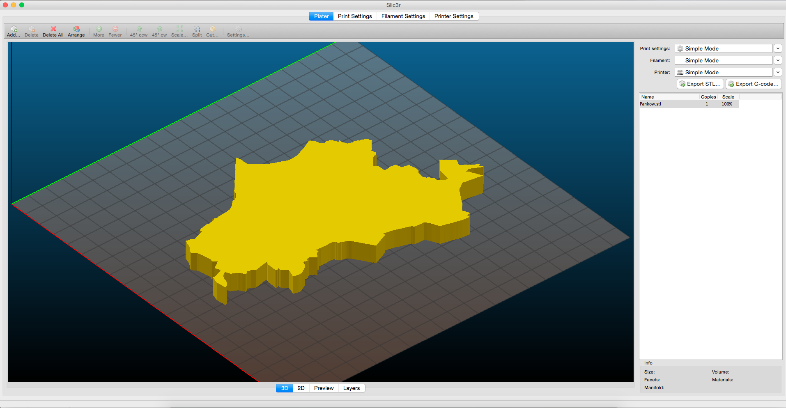

# Berlin District STL Files

3D printing shapes (STL) of all Berlin districts. Free to use for all purposes.

Based on open geodata from the City of Berlin: [Source](http://fbinter.stadt-berlin.de/fb/wfs/data/senstadt/s_wfs_alkis_bezirk)

Converted with [GeoJSON2STL](https://github.com/russbiggs/geojson2stl)

Brought to you by [ODIS](https://odis-berlin.de) and the [Ideation & Prototyping Lab](https://lab.technologiestiftung-berlin.de)

